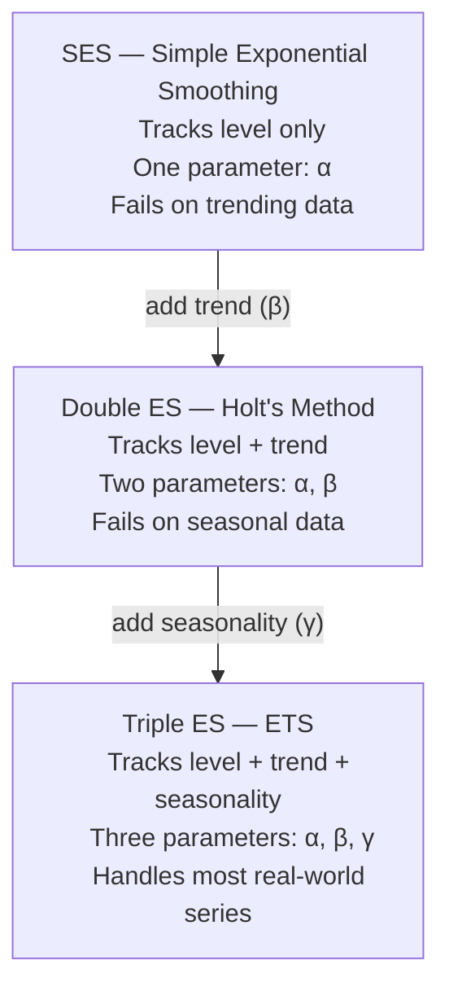
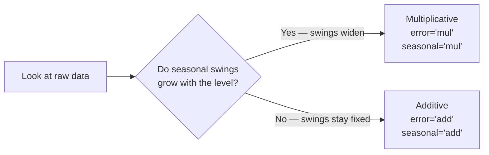
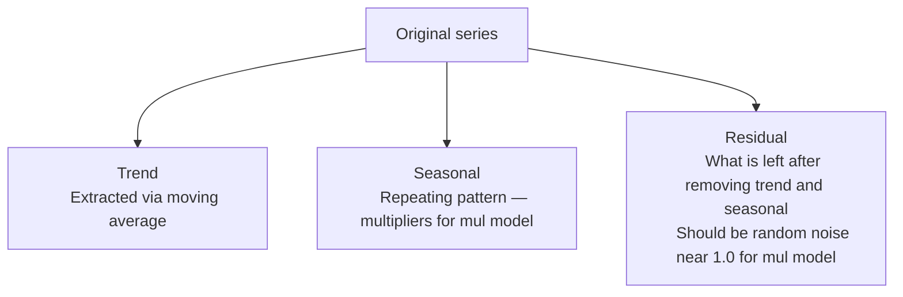

# ETS: Exponential Smoothing

## Core Idea
Recent observations matter more than old ones.
The influence of each past observation fades exponentially as it gets older.

## The Three Components

| Component | Parameter | Controls |
|-----------|-----------|----------|
| Level | alpha (α) | How fast the current level updates |
| Trend | beta (β) | How fast the trend estimate updates |
| Seasonal | gamma (γ) | How fast the seasonal pattern updates |

### Alpha behaviour
- α close to 1 → almost entirely trust the most recent observation
- α close to 0 → forecast barely updates, stays near initial value

### Beta behaviour
- β close to 1 → trend estimate reacts quickly to changes in direction
- β close to 0 → trend estimate is stable, changes slowly

### Gamma behaviour
- γ close to 0 → seasonal pattern is fixed, learned early and barely revised
- γ close to 1 → seasonal pattern updates aggressively each cycle

---

## Evolution: SES → Double → Triple



---

## Why SES Fails on Trending Data

SES formula:

```
Forecast(t) = α × Actual(t-1) + (1-α) × Forecast(t-1)
```

With α = 0.8 and actual data 100, 200, 300, 400, 500:

| t | Actual | Forecast | Gap |
|---|--------|----------|-----|
| 1 | 100 | 100 | 0 |
| 2 | 200 | 100 | 100 |
| 3 | 300 | 180 | 120 |
| 4 | 400 | 276 | 124 |
| 5 | 500 | 381 | 119 |

The gap stabilises but never closes — SES is permanently one step behind.

---

## Additive vs Multiplicative



**Additive**: effect is a fixed amount added to the trend
`Forecast = Level + Trend + Seasonal`

**Multiplicative**: effect is a ratio multiplied by the trend
`Forecast = Level × Trend × Seasonal`

---

## Decomposition

Before fitting ETS, decompose the series to confirm your assumptions:



**Multiplicative decomposition**:
`Original = Trend × Seasonal × Residual`

Clean residuals near 1.0 → model choice was correct.
Residuals with a pattern → wrong model choice.

---

## Model Selection: AIC

If you have not done EDA, fit all combinations and compare AIC:

| error | trend | seasonal | AIC |
|-------|-------|----------|-----|
| add | add | add | ... |
| add | mul | add | ... |
| mul | mul | mul | ... |

Lower AIC = better. AIC penalises both poor fit and model complexity.

---

## Airline Passengers Results

- Dataset: monthly passengers 1949–1960, 144 observations
- Train: 132 months, Test: 12 months
- Model: `ETS(MMM)` — multiplicative error, trend, seasonal

### Fitted parameters

| Parameter | Value | Interpretation |
|-----------|-------|----------------|
| α (level) | 0.9999 | Almost entirely trusts most recent observation |
| β (trend) | 0.0001 | Trend is consistent — barely needs updating |
| γ (seasonal) | 0.0001 | Seasonal shape is stable — learned early |

### Evaluation metrics

| Metric | Value | Meaning |
|--------|-------|---------|
| MAE | 15.48 | Average absolute error in passengers |
| RMSE | 22.63 | Penalises large errors more — close to MAE means no catastrophic errors |
| MAPE | 3.45% | Forecast is correct to within ~3.5% on average |

---

## When to Use ETS

**Use ETS when:**
- Data has a clear trend, seasonality, or both
- Series is univariate (one variable)
- Forecast horizon is short to medium term
- You want an interpretable, fast model

**Do not use ETS when:**
- Data has external drivers (promotions, holidays, weather)
- Multiple seasonalities (hourly data with daily + weekly cycles)
- Very long forecast horizons
- You need to model relationships between multiple series
