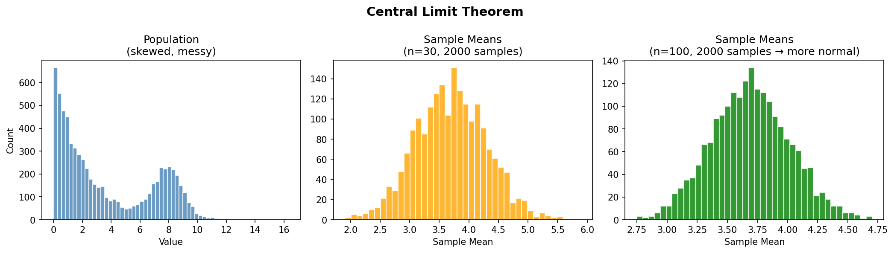
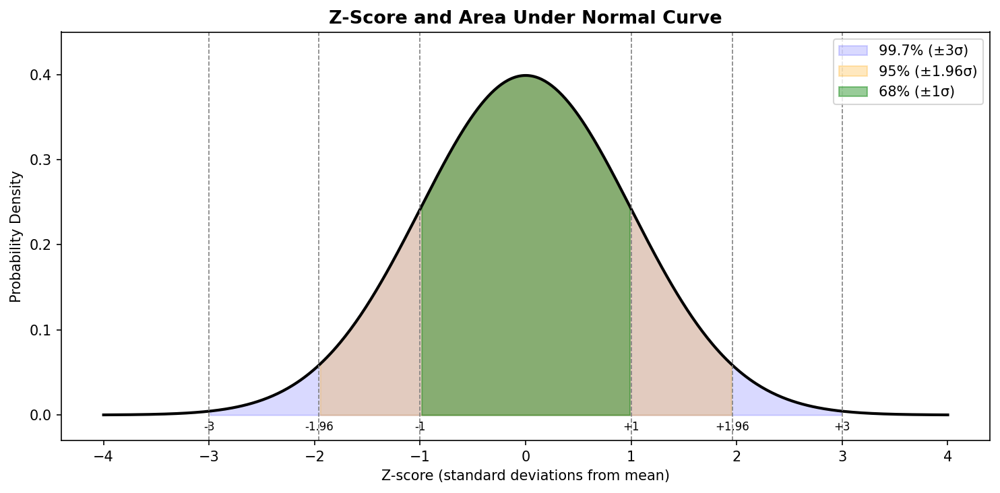
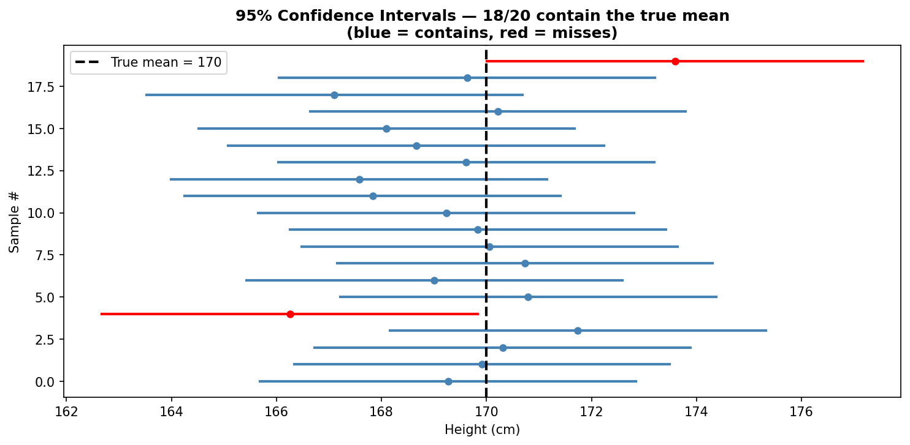
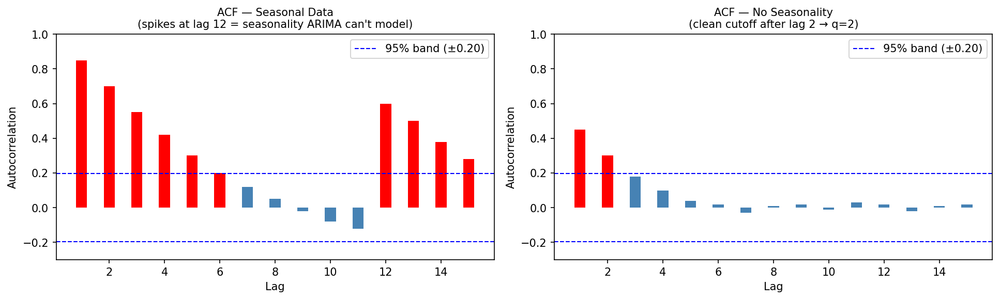

# AR(1) Stability — Effect of φ₁ on y_t = φ₁ · y_{t-1}

Starting value y_0 = 10, no noise. Each row shows y_t over time.

## φ₁ = 0.1 (fast decay → stationary)
```
t=0  |██████████| 10.0
t=1  |█         |  1.0
t=2  |          |  0.1
t=3  |          |  0.01
→ Quickly collapses to 0. Stable.
```

## φ₁ = 0.9 (slow decay → stationary)
```
t=0  |██████████| 10.0
t=1  |█████████ |  9.0
t=2  |████████  |  8.1
t=3  |███████   |  7.3
t=10 |███       |  3.5
t=20 |█         |  1.2
→ Decays slowly but eventually reaches 0. Still stable.
```

## φ₁ = 1.0 (random walk → NON-stationary)
```
t=0  |██████████| 10.0
t=1  |██████████| 10.0
t=2  |██████████| 10.0
→ Value never decays. Any shock accumulates forever.
   Mean and variance grow over time → non-stationary.
   This is a RANDOM WALK. Differencing (d=1) fixes this.
```

## φ₁ = 1.1 (explosive → non-stationary)
```
t=0  |██████████ | 10.0
t=1  |███████████| 11.0
t=2  |████████████████| 12.1
t=3  |████████████████████| 13.3
→ Explodes to infinity. Completely unstable.
```

## Key Insight
```
|φ₁| < 1  →  series is stationary (effect of past dies out)
|φ₁| = 1  →  random walk (shocks accumulate, need d=1 differencing)
|φ₁| > 1  →  explosive, non-stationary
```

Why differencing helps when φ₁ = 1:
  Original:    y_t = y_{t-1} + error       <- non-stationary
  Differenced: Δy_t = y_t - y_{t-1} = error <- stationary (white noise)

---

# Central Limit Theorem → Z-Score → Confidence Interval

## 1. Central Limit Theorem (CLT)

You have a population (e.g. heights of all students in India).
Take many random samples, compute the mean of each.



**Key insight**: No matter how messy the population is, the distribution
of sample means is always approximately normal — given large enough samples.

Mean of sample means    = population mean (μ)
Std dev of sample means = standard error = σ / √N

---

## 2. Z-Score

Z-score = how many standard deviations a value is from the mean.

```
z = (x - μ) / σ
```



| Confidence | Z-score |
|------------|---------|
| 90%        | ±1.645  |
| 95%        | ±1.96   |
| 99%        | ±2.576  |

---

## 3. Confidence Interval

"I sampled 30 students, got mean height = 170cm. True population mean is somewhere around this — but how far off could I be?"

```
CI = sample_mean ± z * standard_error
   = x̄ ± 1.96 * (σ / √N)

Example: x̄=170, σ=10, N=100
  SE = 10 / √100 = 1
  CI = 170 ± 1.96 * 1 = [168.04, 171.96]

"I am 95% confident the true mean lies between 168 and 172 cm"
```



---

## 4. Back to ACF Confidence Band

ACF measures correlation of y_t with y_{t-k}.
Under null hypothesis (no true autocorrelation), sample ACF ~ Normal(0, 1/√N).

So the 95% confidence band is:  ±1.96 / √N

Any spike outside = statistically significant autocorrelation at that lag.
Any spike inside  = could just be random noise.


