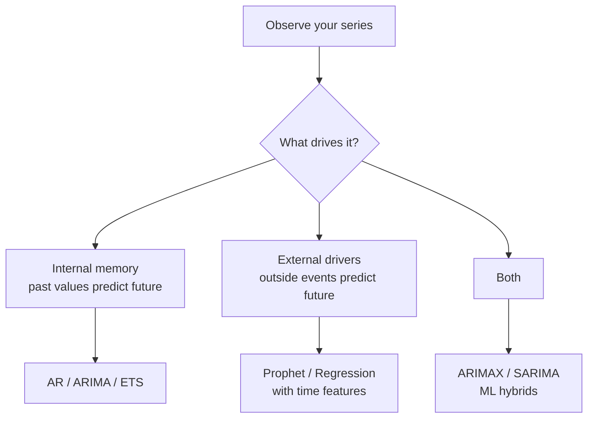
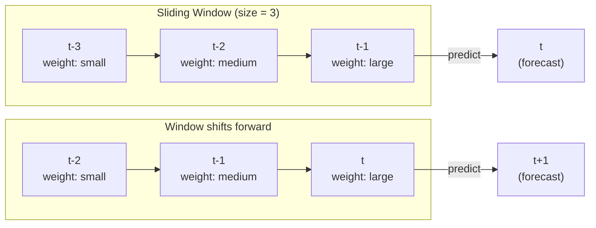
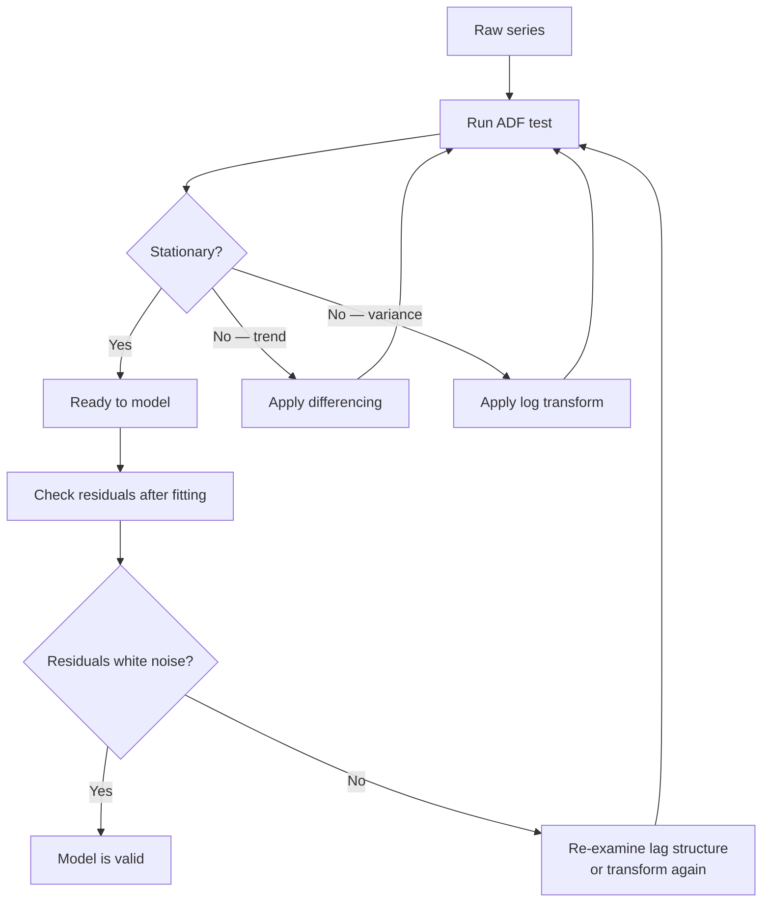
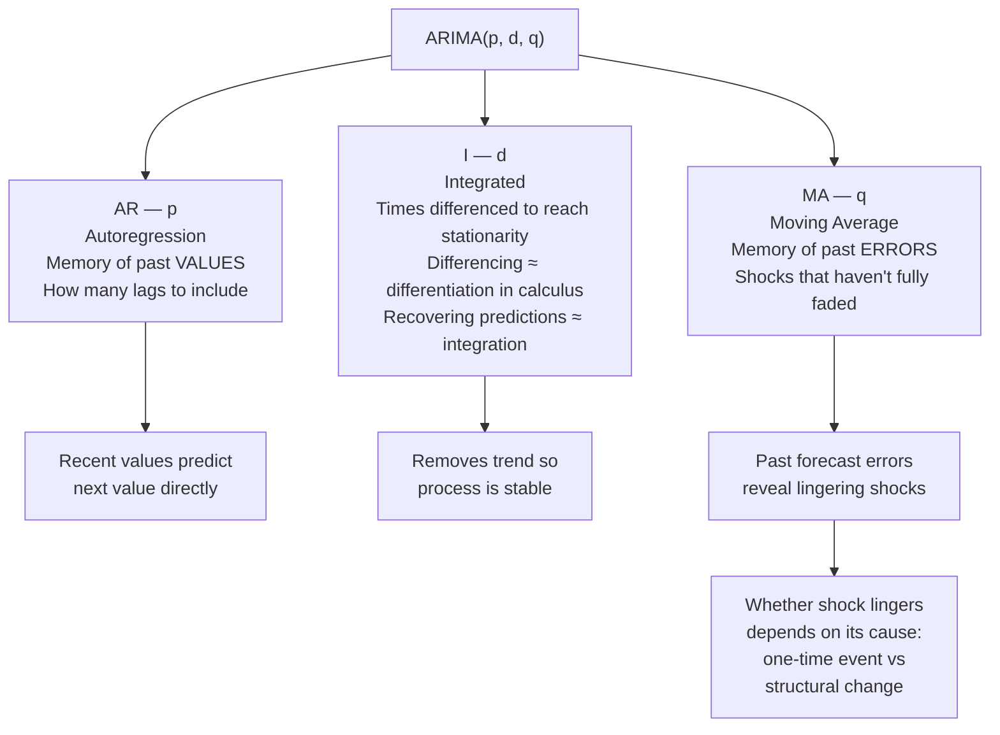
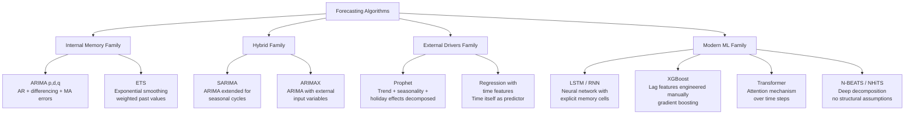
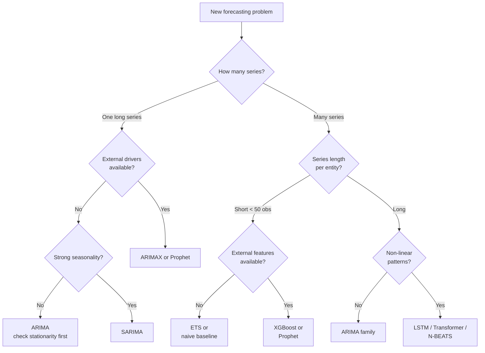

# Time Series Forecasting — Course Notes

---

# 1. What Is Forecasting

Forecasting uses **historical patterns to predict the future**. The output is a **range of plausible values**, not a single point — uncertainty grows with the horizon.

Two sources of repetition in a series:

| Source | Mechanism | Example |
|---|---|---|
| **External drivers** | Independent events cause the outcome | Weather causes umbrella sales |
| **Internal momentum** | Past values influence future values | Momentum in stock prices |

---

# 2. The Fundamental Question

> **Before picking any algorithm: does the series have internal memory, external drivers, or both?**

This question drives every modeling decision downstream.

---

# 3. Regression Recap

- **Regression** = finding weights that best explain an output from inputs
- **The act of regressing** = iteratively adjusting weights until error is minimized
- **Autoregression** = regression where the inputs are **past values of the same series**
- "Auto" comes from Greek *autos* = self — same root as *autobiography*

---

# 4. Autoregression (AR)

Past values of a series predict its future values. Key ideas:

- **Lag structure** — how many past values (lags) to include as predictors
- **Influence fades with distance** — recent past matters more than distant past
- A **sliding window** of fixed size moves forward one period at a time

Each step: drop the oldest observation, add the newest, reuse the same weights.

---

# 5. Stationarity

## Definition
A series is **stationary** if its statistical properties — mean and variance — do not drift over time.

## Why It Matters
AR and ARIMA models assume a **stable underlying process**. If mean or variance shifts, the model's learned parameters become unreliable.

## Non-Stationarity Types

| Type | Description | Fix |
|---|---|---|
| **Drifting mean** (trend) | Mean increases or decreases over time | Differencing |
| **Growing variance** | Spread of values expands over time | Log transformation |
| **Structural break** | Process fundamentally changes | Cannot fix by transformation |

## Achieving Stationarity — Iterative Process

## ADF Test (Augmented Dickey-Fuller)
- Null hypothesis: series has a unit root (non-stationary)
- Reject null → evidence of stationarity
- Low p-value (< 0.05) → stationary

> Stationarity is a time series concept — not a requirement in all statistical problems.

**Structural breaks** (policy changes, recessions) cannot be removed by transformation — the process itself changed.

---

# 6. ARIMA(p, d, q)

Three components, each capturing a different source of predictability:

## Component Summary

| Component | Parameter | What it captures |
|---|---|---|
| **AR** | p | How many past values influence today |
| **I** | d | How many differences needed for stationarity |
| **MA** | q | How many past forecast errors influence today |

The "Integrated" terminology comes from calculus: differencing a series is analogous to differentiation; reconstructing the original level from differences is analogous to integration.

---

# 7. ARIMA Limitations

| Limitation | Detail |
|---|---|
| Single long series | No concept of learning across multiple entities |
| Data requirements | Needs 50+ observations for stable parameter estimates |
| Linearity | Assumes linear relationships; non-linear requires manual transformation |
| Structural breaks | Cannot model processes that fundamentally change |
| Panel data | Not designed for many short series with cross-sectional patterns |

**Not suitable for:** short series per entity, retail with many SKUs, externally-driven processes, any setting where cross-series information matters.

---

# 8. Forecasting Algorithm Landscape

---

# 9. Algorithm–Dataset Pairings

| Algorithm | Natural Dataset | Why It Fits |
|---|---|---|
| **ETS** | Airline passengers (monthly 1949–1960) | Smooth trend + growing seasonality; ETS handles multiplicative seasonality cleanly |
| **ARIMA** | Stock price returns (daily) | Stationary after differencing; internal momentum signal |
| **SARIMA** | Electricity consumption (hourly) | Strong multi-frequency seasonal cycles (daily + weekly) |
| **Prophet** | Wikipedia page views (daily) | Holiday spikes, trend changes, missing data — all handled natively |
| **XGBoost** | Retail sales (daily, many stores) | Many series, external features (promotions, holidays), no long-memory assumption |
| **LSTM** | Weather temperature (hourly) | Long sequences, non-linear patterns, sequential dependencies |
| **Transformers** | Energy demand (multi-site) | Long-range dependencies, attention across many series simultaneously |

---

# 10. Algorithm Selection Decision Flow

---

# 11. Key Principles

1. **Data structure determines algorithm choice** — the series itself tells you which model class applies
2. **Stationarity is the price of admission** for models that exploit temporal order
3. **Achieving stationarity is iterative and messy** — transform, test, transform again
4. **"Personalized forecasting" does not always require separate models per entity** — cross-series learning can outperform entity-specific models on short series
5. **Always ask first:** does my series have internal memory, external drivers, or both?

---

## Quick Reference: Algorithm Properties

| Algorithm | Handles trend | Handles seasonality | External features | Multiple series | Min obs |
|---|---|---|---|---|---|
| ARIMA | via d | No | No | No | 50+ |
| ETS | Yes | Yes | No | No | 20+ |
| SARIMA | via d | Yes | No | No | 50+ |
| ARIMAX | via d | No | Yes | No | 50+ |
| Prophet | Yes | Yes | Yes (holidays) | No | Any |
| XGBoost | via features | via features | Yes | Yes | Any |
| LSTM | Yes | Yes | Yes | Yes | Large |
| Transformer | Yes | Yes | Yes | Yes | Large |
